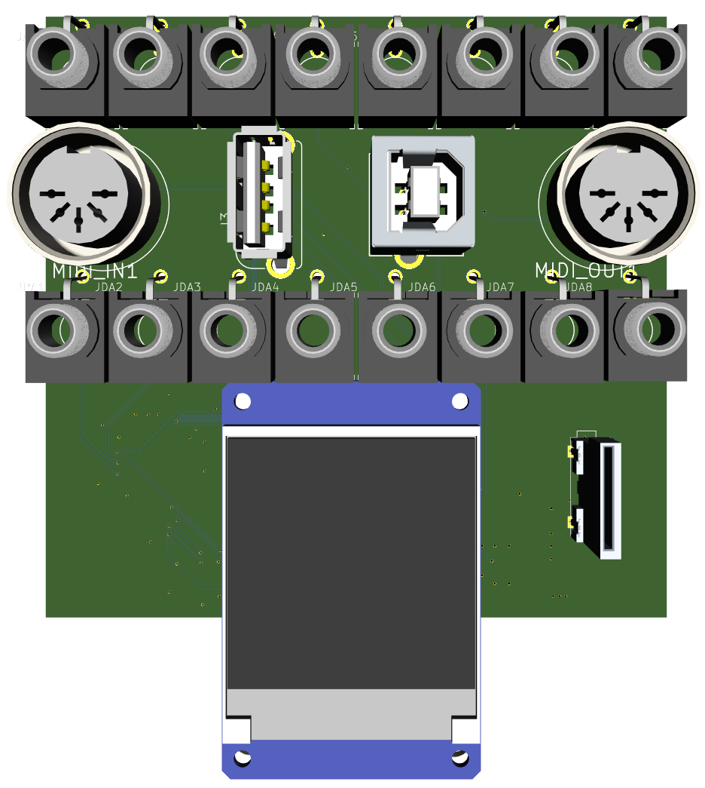
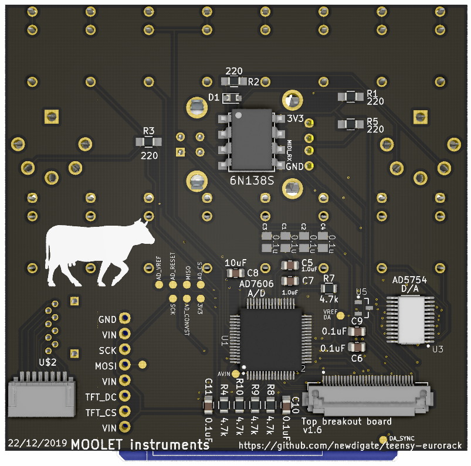

# eurorack digital audio-module prototyping dev-kit 
       
* *(work in progress)* open source **[hardware](hardware) and [software](software) for a [teensy 4](https://www.pjrc.com/store/teensy40.html "teensy 4 board") eurorack shield** 

* (working on updating to [teensy 4](https://www.pjrc.com/teensy-4-0/) )

## contents
* [what is it](#what-is-it)
* [software](#open-source-software-stack)
* [support](#support)
* [social media](#social-media)
* [printed circuit boards](#printed-circuit-boards)
  * [mainboard](#mainboard)
  * [breakout boards](#breakout-boards)
    * [top breakout](#top-breakout)
    * [knobs-controller](#knobs-controller)
    * [uSD extension breakout](#usd-extension-breakout)
* [assembly technical drawings](#assembly-technical-drawings)
* [videos](#videos)
* [todo](#todo)

## what is it 
A set of circuit and pc-board designs for kicad, integrating all the components you need for prototyping a digital audio module for eurorack

*audio codec circuit originally started as a discussion on quad audio channel outputs and a pcb design integrating teensy and cs42448 from Paul Stoffregen on [pjrc forum](https://forum.pjrc.com/threads/41371-Quad-channel-output-on-Teensy-3-6?p=138828&viewfull=1#post138828)*
* cortex m7 microcontroller (teensy 4.0) interfacing the follow components
  * **audio:** multi-channel audio codec ( 6-in / 8-out 24-bit sound card - [CS42448](https://statics.cirrus.com/pubs/proDatasheet/CS42448_F5.pdf) )
  * **analog ins/outs:** -10V to 10V 16bit/sample control voltage 8 x inputs and 4 x outputs ( [ad7606](https://www.analog.com/media/en/technical-documentation/data-sheets/ad7606_7606-6_7606-4.pdf), [ad5754](https://www.analog.com/media/en/technical-documentation/data-sheets/AD5724_5734_5754.pdf) )
  * **display:** ST7735 128x128 16bit-color tft display
  * **breakouts:** - for uSD card, USB host/device, midi in/out, 2 x teensy analog in/out (0 to 3v3 w/protection)
* 20HP aluminium panel mounted for eurorack case
* write arduino compatible c/c++ firmware & program using arduino/teensyduino ([plus teensy audio library](https://www.pjrc.com/teensy/gui/))

## Open source software stack
* All schematics and circuit boards are created using [Kicad](http://kicad-pcb.org/) 
* All mechanical designs are created using [FreeCAD](https://github.com/FreeCAD/FreeCAD)
 
## support
This project is a work-in-progress! 

What you can do if you like to see progress with this project?
* star this repository (means you need a github account - go for it!!)
* subscribe [Nic N on youtube](https://www.youtube.com/channel/UChMicDp8wUXYzBhEN-Wvb5g) & [DIY Audio Electronics Maker](https://www.youtube.com/channel/UChMicDp8wUXYzBhEN-Wvb5g)
* clone this repo, make improvements, commit & send pull-requests

## social media
* facebook: 
  * [Moolet](https://www.facebook.com/Moolet-249737938397431/)
* youtube:
  * [Nic N](https://www.youtube.com/channel/UChMicDp8wUXYzBhEN-Wvb5g) 
  * [DIY Audio Electronics Maker](https://www.youtube.com/channel/UChMicDp8wUXYzBhEN-Wvb5g)

# printed circuit boards

## [mainboard](hardware/boards/mainboard) 
* **2-layer:** 
* teensy4
* cs42448 audio codec 
* 3 x 6.35mm stereo TRS jack inputs
* 4 x 6.35mm stereo TRS jack outputs
* connectors for top and bottom breakout boards

  

## breakout boards 
### [top breakout](hardware/boards/topbreakout) 
* **2-layer:** 
* 3.5mm jack analog inputs/outputs
* midi in/out, 
* usb device/host,
* microSD female connector

 

### [knobs-controller](hardware/boards/knobs-controller) 
* **2-layer:** 
* 4 x pots
* 3 x RGB rotary encoders with switches 
* SAMD21 32bit 48Mhz micro-controller
* Based on Arduino MKR Zero board (can be programmed through standard arduino ide)
* Communicates with mainboard via standard serial uart RX and TX lines.

 

# assembly technical drawings 

## videos 

## todo 
- [ ] General
  - [ ] refactor folders so that footprints, symbols and 3d models (should be shared common amoung project, not board-specific)
- [ ] Breakout board for rotary encoders and pots
  - [x] ~~Order~~
  - [x] ~~Assemble~~
  - [ ] Software
  - [ ] Certify
- [x] ~~panel~~
  - [x] ~~measurements~~
  - [x] ~~design~~
- [ ] Finalize circuits / boards
- [ ] Testing
  - [ ] CS42448 audio codec
  - [ ] control voltage input
  - [ ] control voltage output
  - [ ] usb host/device
  - [ ] midi in/out
  - [ ] sd card extension & adapter
- [ ] Document 
  - [ ] order & build process
  - [ ] software process
- [ ] Firmware
  - [ ] Sliced audio loops
  - [ ] Midi looping
