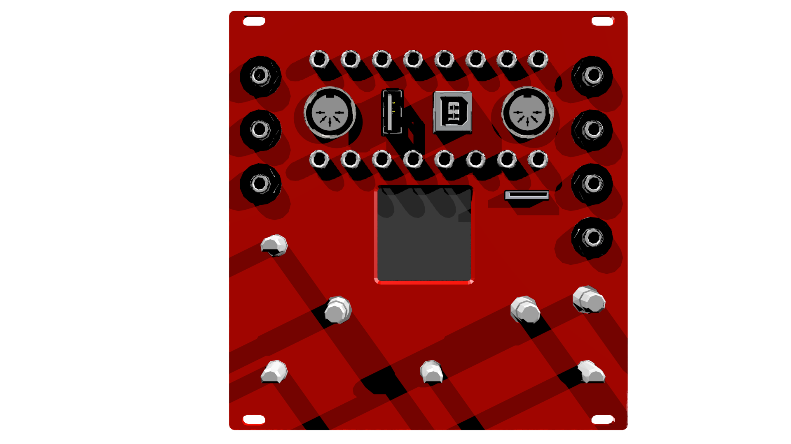
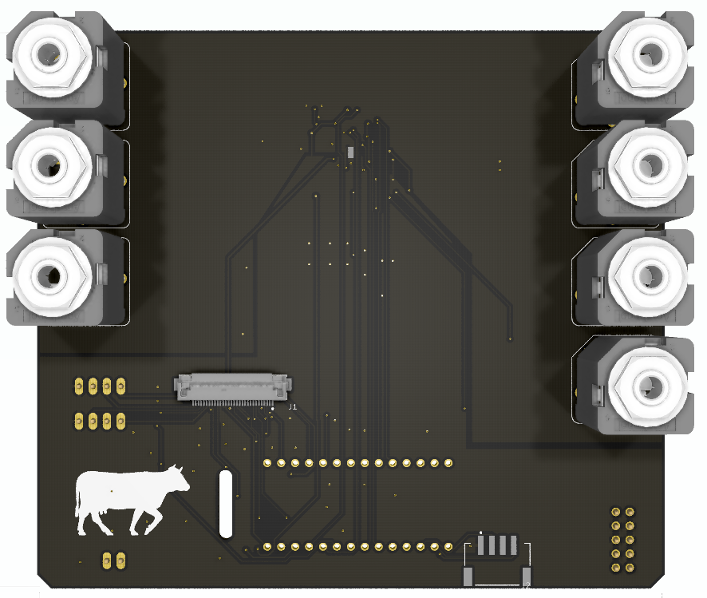
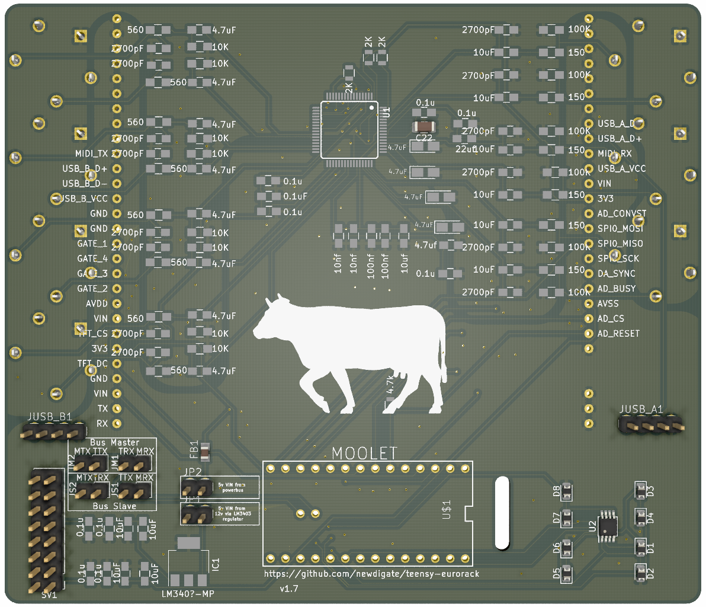
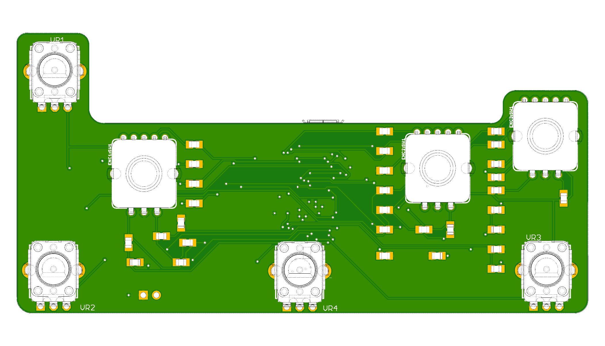
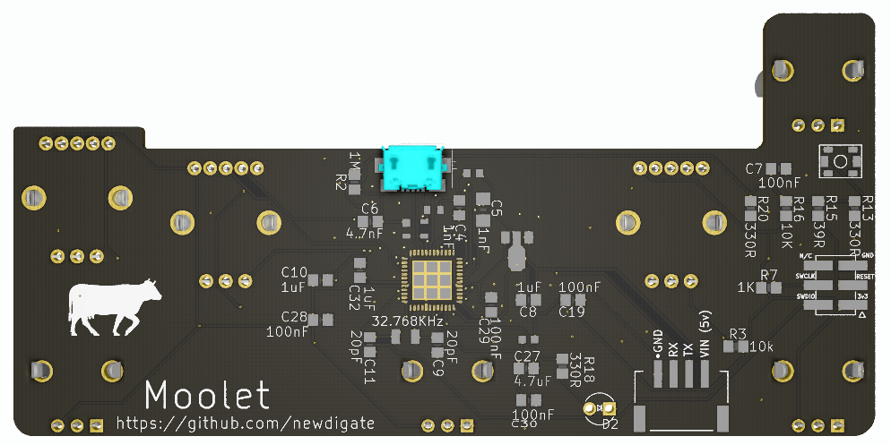
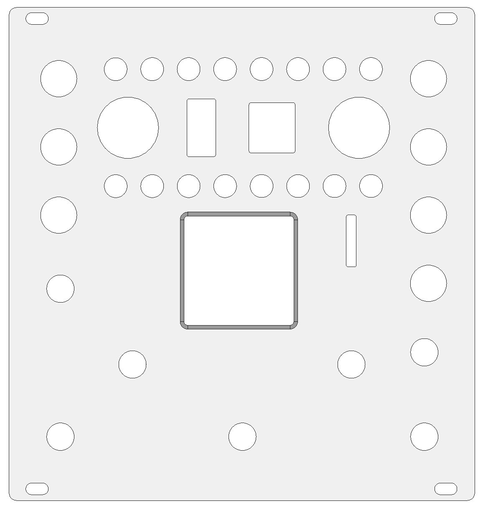

# eurorack digital audio-module dev-kit [](https://gitter.im/newdigate/teensy-eurorack?utm_source=badge&utm_medium=badge&utm_campaign=pr-badge&utm_content=badge)

**open source [hardware](hardware) and [software](software) for a [teensy 4.0](https://www.pjrc.com/store/teensy40.html "teensy 4.0 board") eurorack shield** 

These circuit boards provide the peripherals necessary to interface a [teensy 4.0](https://www.pjrc.com/store/teensy40.html "teensy 4.0 board") with stereo line audio and eurorack modular equipment.

* [specifications](#specifications)
* [open source software-stack](#open-source-software-stack)
* [support](#support)
* [social media](#social-media)
* [printed circuit boards](#printed-circuit-boards)
  * [mainboard](#mainboard)
  * [breakout board](#breakout-board)
* [panel design](#panel-design)  
* [assembly technical drawings](#assembly-technical-drawings)
* [videos](#videos)
* [versions](#versions)
* [todo](#todo)



## specifications
* **microcontrollers:** 
  * 600 Mhz ARM cortex m7 ( [teensy 4.0 board](https://www.pjrc.com/store/teensy40.html "teensy 4.0 board") )
  * SAMD21 32bit 48Mhz micro-controller (based on [arduino mkr1000](https://www.arduino.cc/en/Guide/MKR1000))
* **audio:** multi-channel audio codec ( 6-in / 8-out 24-bit sound card - [CS42448](https://statics.cirrus.com/pubs/proDatasheet/CS42448_F5.pdf) )
  * *the audio codec circuit originally started as a discussion on quad audio channel outputs and a pcb design integrating teensy and cs42448 from Paul Stoffregen on [pjrc forum](https://forum.pjrc.com/threads/41371-Quad-channel-output-on-Teensy-3-6?p=138828&viewfull=1#post138828)*
* **analog control voltage ins/outs:** -10V to 10V 16bit/sample, 8 x inputs and 4 x outputs ( [ad7606](https://www.analog.com/media/en/technical-documentation/data-sheets/ad7606_7606-6_7606-4.pdf), [ad5754](https://www.analog.com/media/en/technical-documentation/data-sheets/AD5724_5734_5754.pdf) )
* **display:** ST7735 128x128 16bit-color tft display
* **breakouts:** 
  * microSD card socket, 
  * USB host/device, 
  * midi in/out, 
  * knobs (4 x pots, 3 x RGB encoders w/switch)
* **gpio:** 4 x configurable 5v logic inputs/outputs. [PCA9536](https://www.ti.com/lit/ds/symlink/pca9536.pdf)
* **panel:** 24HP aluminium panel mounted for eurorack case
* **programability**: 
  * write arduino compatible c/c++ firmware & program using arduino/teensyduino
  * arm gnu toolchain [downloads](https://developer.arm.com/tools-and-software/open-source-software/developer-tools/gnu-toolchain/gnu-rm/downloads)
  * teensy [audio library](https://www.pjrc.com/teensy/gui/)

## Open source software stack
* All [schematics](hardware/CIRCUITS.md) and boards are created using [Kicad](http://kicad-pcb.org/) 
* All mechanical designs are created using [FreeCAD](https://github.com/FreeCAD/FreeCAD)
* Some images have been rendered using [Blender 2.81](https://www.blender.org/)

## support
This project is a work-in-progress! Here is a journal of my progress, [journal.md](hardware/JOURNAL.md) 

What you can do if you like to see progress with this project?
* star this repository (means you need a github account - go for it!!)
* subscribe [Nic N on youtube](https://www.youtube.com/channel/UChMicDp8wUXYzBhEN-Wvb5g) & [DIY Audio Electronics Maker](https://www.youtube.com/channel/UChMicDp8wUXYzBhEN-Wvb5g)
* download kicad and freecad, clone this repo, make improvements, commit & send pull-requests, and raise issues...

## social media
* facebook: 
  * [Moolet](https://www.facebook.com/Moolet-249737938397431/)
* youtube:
  * [Nic N](https://www.youtube.com/channel/UChMicDp8wUXYzBhEN-Wvb5g) 
  * [DIY Audio Electronics Maker](https://www.youtube.com/channel/UChMicDp8wUXYzBhEN-Wvb5g)

# printed circuit boards

## [mainboard](hardware/boards/mainboard) 
* standard double layer printed circuit board
  * thinkness: 1.6mm  
  * minimum trace: 6 mil
  * minimum clearance: 6 mil
  * dimension: 118mm*102mm
* socket to connect teensy 4.0 board
* cs42448 audio codec 
* 3 x stereo 6.35mm TRS jack inputs
* 4 x stereo 6.35mm TRS jack outputs
* pin sockets to connect breakout board
* PCA9536 gpio

  

## breakout board
* standard double layer printed circuit board
  * thinkness: 1.6mm  
  * minimum trace: 6 mil
  * minimum clearance: 6 mil
  * dimension: 110mm*111mm
* 8 x 3.5mm jack socket for analog control voltage inputs
* 4 x 3.5mm jack socket for analog control voltage outputs
* 4 x 3.5mm jack socket for 5v GPIO (general purpose inputs or outputs)
* midi in/out DIN sockets
* usb device/host
  * USB-B: USB device mode
  * USB-A: USB host mode
* micro-SD card socket
* 4 x linear pots
* 3 x RGB rotary encoders with switches 
* SAMD21 32bit 48Mhz micro-controller for pots and rotaries
  * Based on Arduino MKR Zero board (can be programmed through standard arduino ide)
* Communicates with mainboard via standard serial uart RX and TX lines.

 

# [panel design](hardware/panel)


# assembly technical drawings 


## videos 
[](https://www.youtube.com/watch?v=Jx2KgpoT3WY)

[](https://www.youtube.com/watch?v=s-514rDjirY)

[](https://www.youtube.com/watch?v=6zt6OF7UOTc)


## versions
### v1.7b (current)
```
status:
 * 26/01/2020: placed pcb order with jlcpcb 
 * 22/02/2020:
   * boards assembled, sanity checks pass, form factor is good - no known issues so far 
   * adc AD7606 tested briefly, looks better
   * usb-device type-b socket tested successfully, serial-over-usb and programming connection seem good
 * 23/02/2020:
   * issue with midi in/out circuits 
     * pin 4 and pin 5 on the midi din connectors appear to be switched on both rx and tx midi sockets
     * tx may need logic level shifter or buffer.
 ```
 * breakout board:
   * fixed: net 3v3 collides with net VIN 
     * LDO footprint imported from eagle is causing DRC check to succeed even though the two traces collide
     
### v1.7 
```
status:
 * 10/01/2020: placed pcb and stencil order with jlcpcb 
   * total is ￡36.05
     * Shipping Charge: ￡13.05
     * Merchandise: ￡23.00 
       * 2 x aluminium stencils: £10.66
       * 2 x 5pcs x pcboard: £12.34
 * 12/01/2020: order dispatched
 * 24/01/2020: pcboards and stencils arrived.
 ``` 
#### v1.7 changes 
* circuit corrections
  * adc: corrected AVSS net, should have been VSS
  * removed unused through-hole pads from underside of teensy board.
* physical
  * merged knobs-controller and top-breakout pc-boards into single board
  * tft display rotated 90 degrees
  * sd-connector socket rotated 90 degrees
  * replaced fine-pitch FPC/FFC connectors with standard 0.1' pin-headers and sockets, allowing boards to connect physically    

### v1.6:
* circuit corrections
  * **corrected:** knobs-controller: tx/rx nets were not connected to socket  
  * **enhancement:** extra uart exposed 
    * allows serial communications via the unused pins in the eurorack power-connector
    * 2 jumper-switches added to switch between master/slave - (rx/tx cross-over configuration)
    * connects to RX7, TX7 (pins 28, 29) on the under-side of the teensy 4.0 board 
  * **enhancement:** adc: AD_RESET net connected to micro-controller
  * **enhancement:** introduced PCA9536 i2c GPIO integrated-circuit to free-up some pins on the micro-controller
    
## todo 
- [ ] General
  - [ ] cleanup / refactor footprints, replace footprints and symbols imported from eagle with kicad equivalents
- [ ] Breakout board for rotary encoders and pots
  - [x] ~~Order~~
  - [x] ~~Assemble~~
  - [ ] software
  - [ ] document
  - [ ] certify
- [x] ~~panel~~
  - [x] ~~measurements~~
  - [x] ~~design~~
- [ ] finalize circuits / boards
- [ ] testing
  - [x] ~~CS42448 audio codec~~
    - [x] ~~Audio input~~
    - [x] ~~Audio output~~
  - [x] ~~control voltage input~~
  - [x] ~~control voltage output~~
  - [ ] gpio
  - [ ] usb host
  - [x] ~~usb device~~
  - [ ] midi in/out
  - [x] ~~st7735 display~~
  - [x] ~~sd card extension & adapter~~
- [ ] Document 
  - [ ] order & build process
  - [ ] software process
- [ ] Firmware
  - [ ] Sliced audio loops
  - [ ] Midi looping
