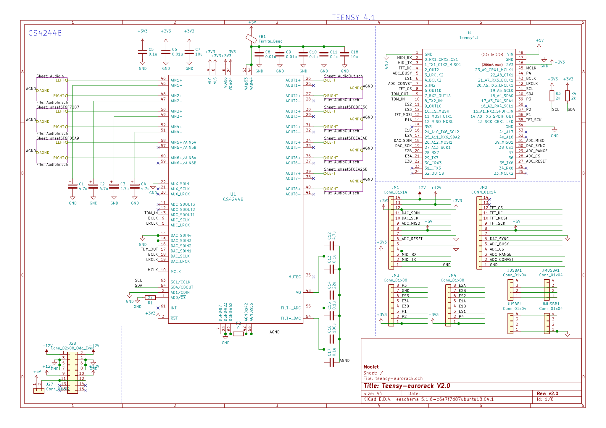
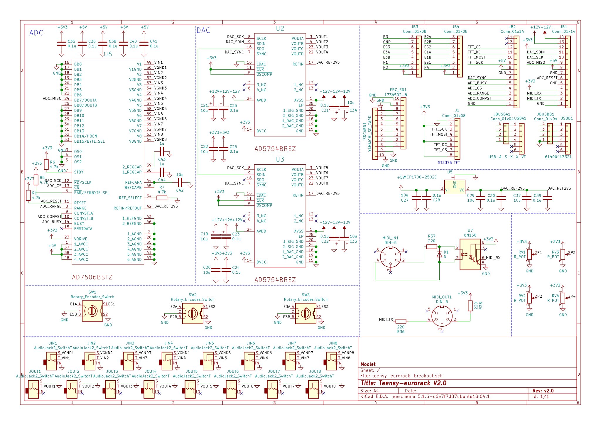
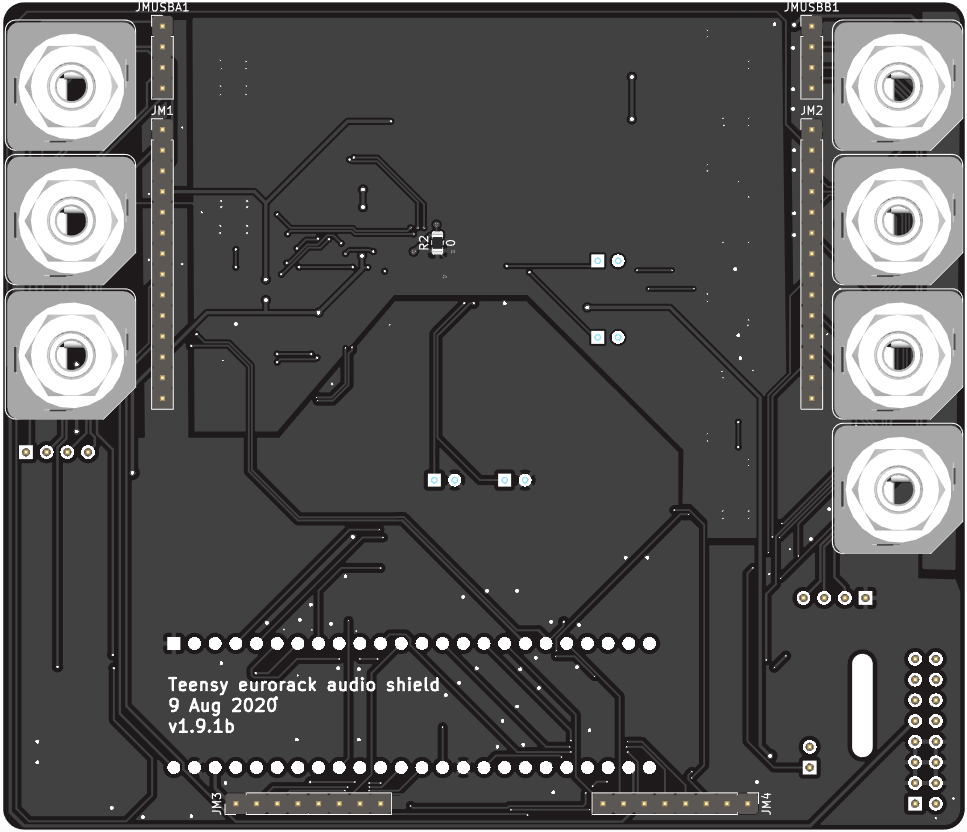
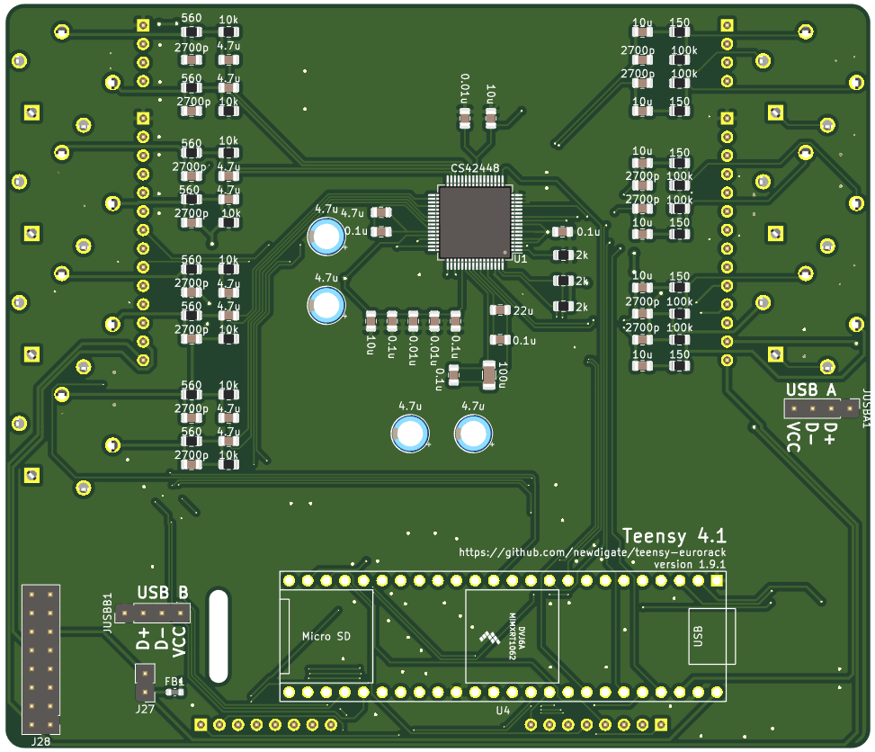
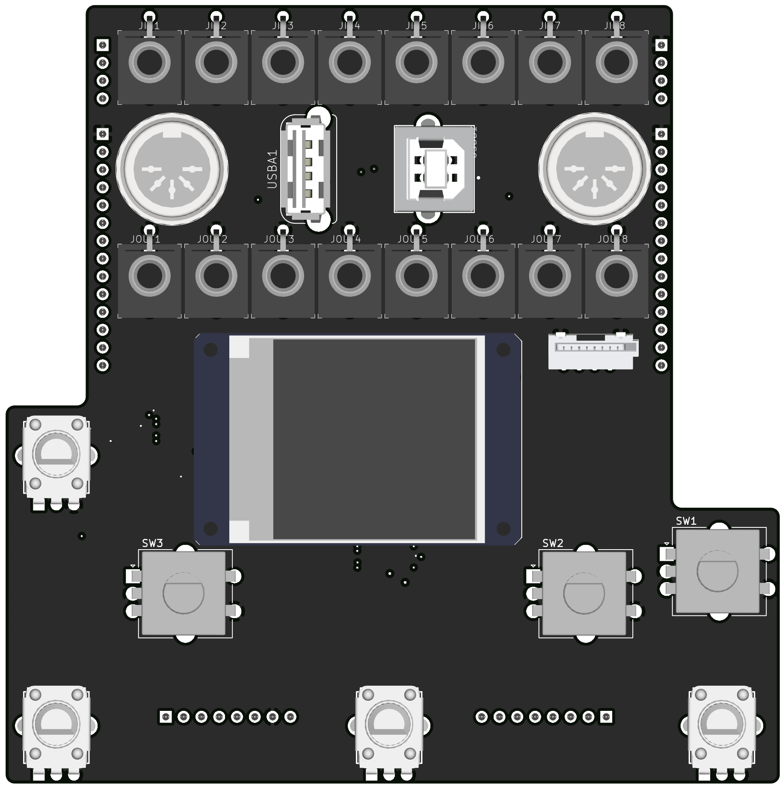
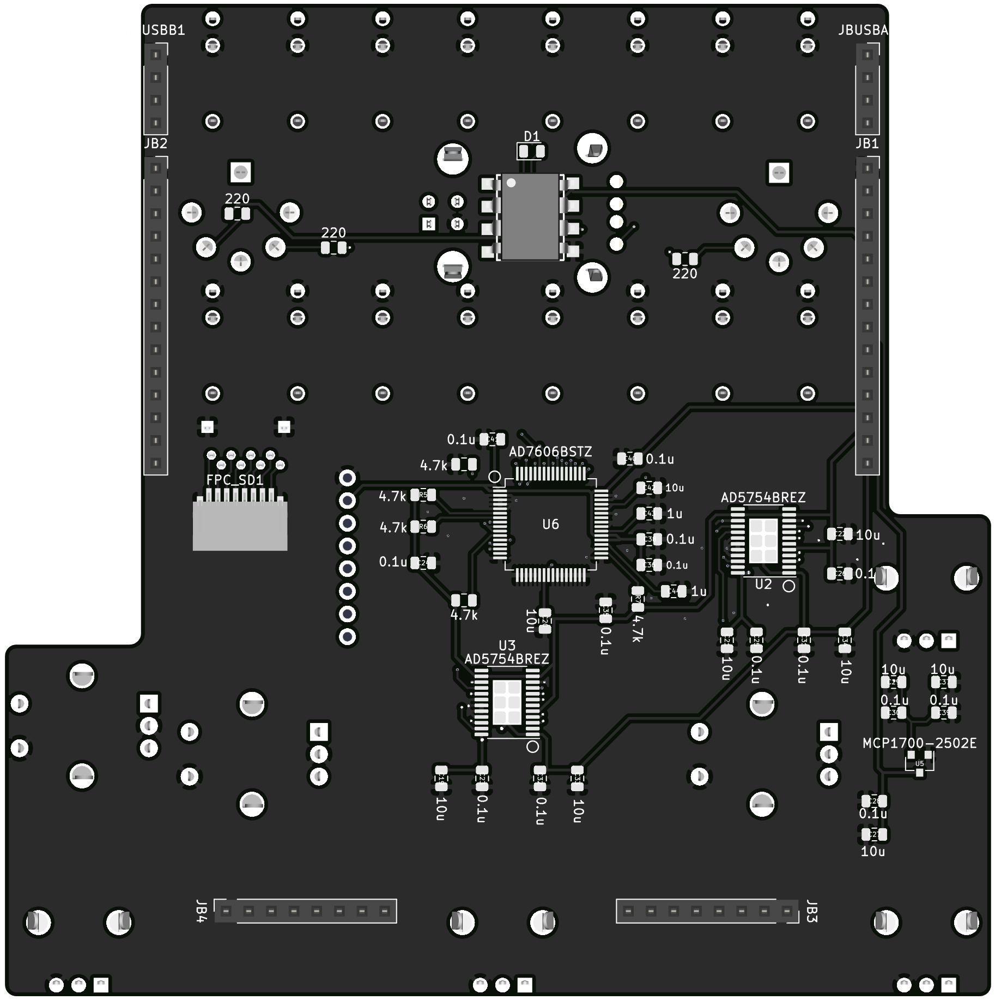

# teensy eurorack audio shield 

[](https://www.pjrc.com/store/teensy41.html)

[](https://gitter.im/newdigate/teensy-eurorack?utm_source=badge&utm_medium=badge&utm_campaign=pr-badge&utm_content=badge)
[](https://github.com/newdigate/teensy-eurorack/actions?query=branch%3Amaster)
[](https://kicad-pcb.org/)
[](LICENSE)

**open source [hardware](hardware) and [software](software) for a [teensy 4.1](https://www.pjrc.com/store/teensy40.html "teensy 4.1 board") eurorack shield** 

extend a [teensy 4.1](https://www.pjrc.com/store/teensy40.html "teensy 4.1 board") with peripherals to interface with stereo line audio and eurorack modular equipment. 

For stable, tested version please see [](https://github.com/newdigate/teensy-eurorack/tree/1.8.1)





* [specifications](#specifications)
* [open source software-stack](#open-source-software-stack)
* [support](#support)
* [social media](#social-media)
* [printed circuit boards](#printed-circuit-boards)
  * [mainboard](#mainboard)
  * [breakout board](#breakout-board)
* [panel design](#panel-design)  
* [assembly technical drawings](#assembly-technical-drawings)
* [videos](#videos)
* [versions](#versions)
* [todo](#todo)

## specifications
* **microcontrollers:** 
  * 600 Mhz ARM cortex m7 ( [teensy 4.1 board](https://www.pjrc.com/store/teensy41.html "teensy 4.1 board") )
* **audio:** multi-channel audio codec ( 6-in / 8-out 24-bit sound card - [CS42448](https://statics.cirrus.com/pubs/proDatasheet/CS42448_F5.pdf) )
  * *the audio codec circuit originally started as a discussion on quad audio channel outputs and a pcb design integrating teensy and cs42448 from Paul Stoffregen on [pjrc forum](https://forum.pjrc.com/threads/41371-Quad-channel-output-on-Teensy-3-6?p=138828&viewfull=1#post138828)*
* **analog control voltage ins/outs:** -10V to 10V 16bit/sample, 8 x inputs and 8 x outputs ( [ad7606](https://www.analog.com/media/en/technical-documentation/data-sheets/ad7606_7606-6_7606-4.pdf), 2x [ad5754](https://www.analog.com/media/en/technical-documentation/data-sheets/AD5724_5734_5754.pdf) )
* **display:** ST7735 128x128 16bit-color tft display
* **breakouts:** 
  * microSD card socket, 
  * USB host/device, 
  * midi in/out, 
  * knobs (4 x pots, 3 x encoders w/switch)
* **panel:** 24HP aluminium panel mounted for eurorack case
* **programability**: 
  * write arduino compatible c/c++ firmware & program using arduino/teensyduino
  * arm gnu toolchain [downloads](https://developer.arm.com/tools-and-software/open-source-software/developer-tools/gnu-toolchain/gnu-rm/downloads)
  * teensy [audio library](https://www.pjrc.com/teensy/gui/)

## MIT open source license
* MIT license unless otherwise specified on a per file basis.

## Open source software stack
* All [schematics](hardware/CIRCUITS.md) and boards are created using [Kicad](http://kicad-pcb.org/) 
* All mechanical designs are created using [FreeCAD](https://github.com/FreeCAD/FreeCAD)
* Some images have been rendered using [Blender 2.81](https://www.blender.org/)

## support
This project is a work-in-progress! The functionality has been tested and are working at a basic level. 

There are some improvements I'd like to make later
* improve noise to signal ratio on pots on breakout board.
* add 4x jack sockets for analog output of knobs on breakout board. 
* use 3.5mm jack sockets (as well as standard midi din connectors) for midi in and out. 
* switch to active audio input and output circuitry, allow switchable 0dB / 12dB gain, for guitar signals.
* let me know if you're think there something else that can be improved, added, removed. 

There is a journal of my progress, [journal.md](hardware/JOURNAL.md) 

What you can do if you like to see progress with this project?
* star this repository (means you need a github account - go for it!!)
* subscribe [Nic N on youtube](https://www.youtube.com/channel/UChMicDp8wUXYzBhEN-Wvb5g) 
* download kicad and freecad, clone this repo, make improvements, commit & send pull-requests, and raise issues...

## social media
* facebook: 
  * [Moolet](https://www.facebook.com/Moolet-249737938397431/)
* youtube:
  * [Nic N](https://www.youtube.com/channel/UChMicDp8wUXYzBhEN-Wvb5g) 

# printed circuit boards
## [mainboard](hardware/boards/mainboard) 
* standard double layer printed circuit board
  * thinkness: 1.6mm  
  * minimum trace: 6 mil
  * minimum clearance: 6 mil
  * dimension: 118mm*102mm
* socket to connect teensy 4.0 board
* cs42448 audio codec 
* 3 x stereo 6.35mm TRS jack inputs
* 4 x stereo 6.35mm TRS jack outputs
* pin sockets to connect breakout board

  

## breakout board
* standard double layer printed circuit board
  * thinkness: 1.6mm  
  * minimum trace: 6 mil
  * minimum clearance: 6 mil
  * dimension: 110mm*111mm
* 8 x 3.5mm jack socket for analog control voltage inputs
* 4 x 3.5mm jack socket for analog control voltage outputs
* 4 x 3.5mm jack socket for 5v GPIO (general purpose inputs or outputs)
* midi in/out DIN sockets
* usb device/host
  * USB-B: USB device mode
  * USB-A: USB host mode
* micro-SD card socket
* 4 x linear pots
* 3 x rotary encoders with switches 

  

# [panel design](hardware/panel)


# assembly technical drawings 


## videos 

* Teensy 4.0 eurorack shield design intro

[](https://www.youtube.com/watch?v=aNUSEszbnYU)

* 0v to 10v control voltage input, output and display using teensy 4.0

[](https://www.youtube.com/watch?v=5d5x8F7HRko)

* DIY assembly build - teensy 4.0 eurorack audio module

[](https://www.youtube.com/watch?v=oZzPgpTrEhc)

* assembling teensy eurorack shield

[](https://www.youtube.com/watch?v=Jx2KgpoT3WY)

* assembly timelapse

[](https://www.youtube.com/watch?v=s-514rDjirY)

* Eurorack digital audio modules powered by teensy micro-controller

[](https://www.youtube.com/watch?v=6zt6OF7UOTc)

* side-channel stereo audio separation with teensy 4.0

[](https://www.youtube.com/watch?v=N0IBevm4hTQ)


## versions
### v1.9.1b
* mainboard: correction: reconnected LRCLK to codec.

### v1.9.1
* connected DAC_SCK output (pin 19) to pin 31
  * allow cable select to be asserted on minor spi data cycle after every 24 or 48 spi clock cycles, using interrupt on pin 31.
    * hopefully this will allow DMA spi transfers to AD5754 and which will make integration with teensy audio library much easier

### v1.9 
updated to teesy 4.1 and improvements to make easier to build
* updated from teensy 4.0 to teensy 4.1
* schematic, footprint and pcb clean-up 
  * replaced footprints imported from eagle with native kicad footprints
* removed atmel samd21 and gpio ICs
* replaced gpio with AD5754 (extra 4 DAC channels)
* replaced RGB encoders with regular encoders
* replaced analog-GND-to-digital-GND footprint with a 0805 zero ohm resistor footprint. (DRC checks can pass now...)
* (temporarily) removed serial TX/RX to unused eurorack power pins
```
status:
  25/07/2020:
    * received pcbs, stencil and components
```
  
## todo 
- [ ] General
  - [ ] cleanup / refactor footprints, replace footprints and symbols imported from eagle with kicad equivalents
- [ ] Breakout board for rotary encoders and pots
  - [x] ~~order~~
  - [ ] assemble
  - [ ] verify
  - [ ] firmware
  - [ ] document
  - [ ] certify
- [x] ~~panel~~
  - [x] ~~measurements~~
  - [x] ~~design~~
- [ ] finalize circuits / boards
- [ ]  testing
  - [ ] CS42448 audio codec
    - [ ] Audio input
    - [ ] Audio output
  - [ ] control voltage input
  - [ ] control voltage output
  - [ ] gpio (input & output) 
  - [ ] usb host
  - [ ] usb device
  - [ ] midi in/out
  - [x] ~~st7735 display~~
  - [x] ~~sd card extension & adapter~~
- [ ] Document 
  - [ ] order & build process
  - [ ] software process
- [ ] Firmware
  - [ ] Sliced audio loops
  - [ ] Midi looping

# build
* testing automated build and packaging 
* [github.com/pwuertz/kicad_picknplace_assistant](https://github.com/pwuertz/kicad_picknplace_assistant)
* [github.com/productize/kicad-automation-scripts](https://github.com/productize/kicad-automation-scripts)
* [InteractiveHtmlBom](https://github.com/openscopeproject/InteractiveHtmlBom) by [openscopeproject](https://github.com/openscopeproject)

# credits 
* https://github.com/dgouramanis/usdextendercable
## 3d models
* potentiometer: https://grabcad.com/library/potentiometer-30
