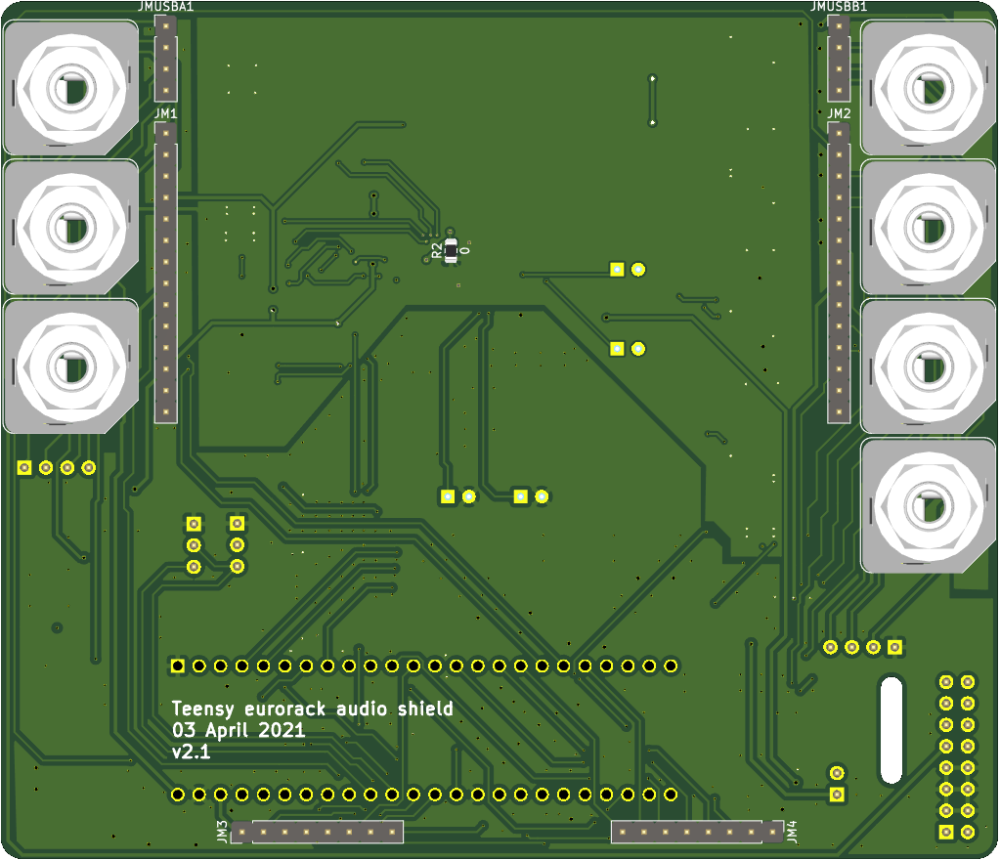
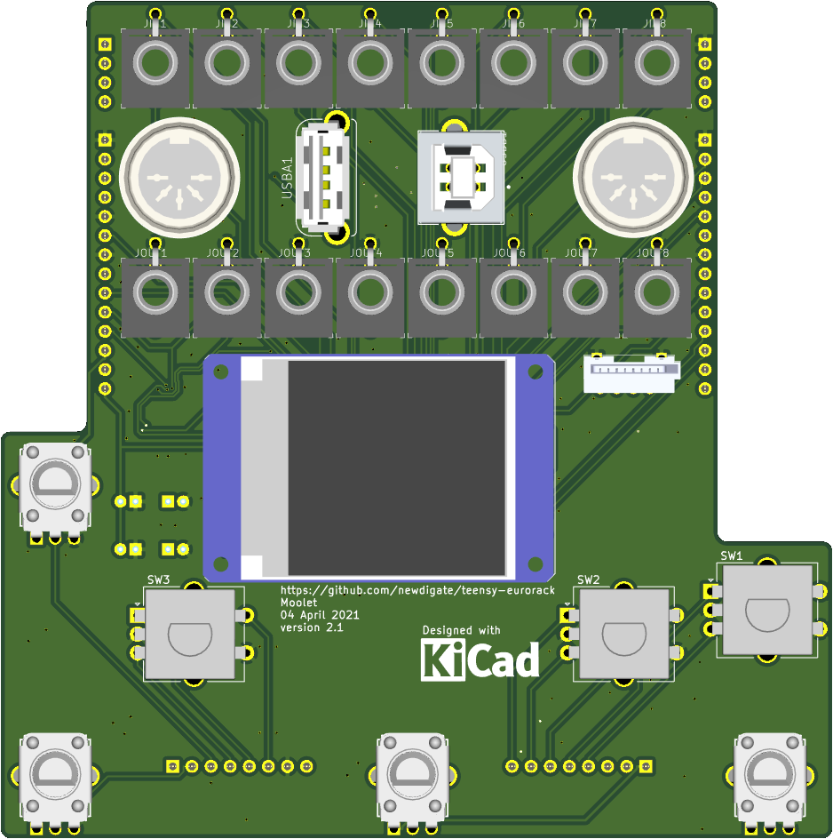
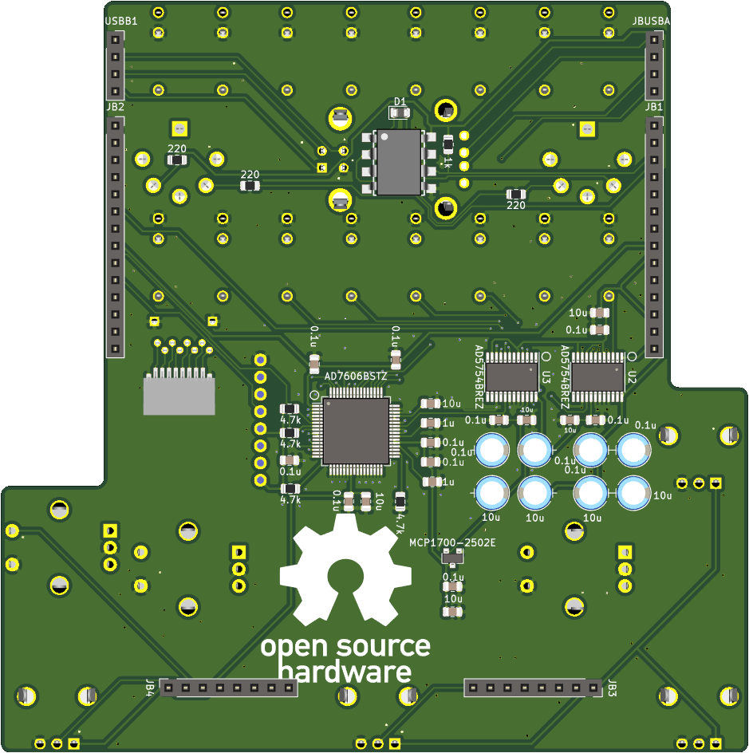
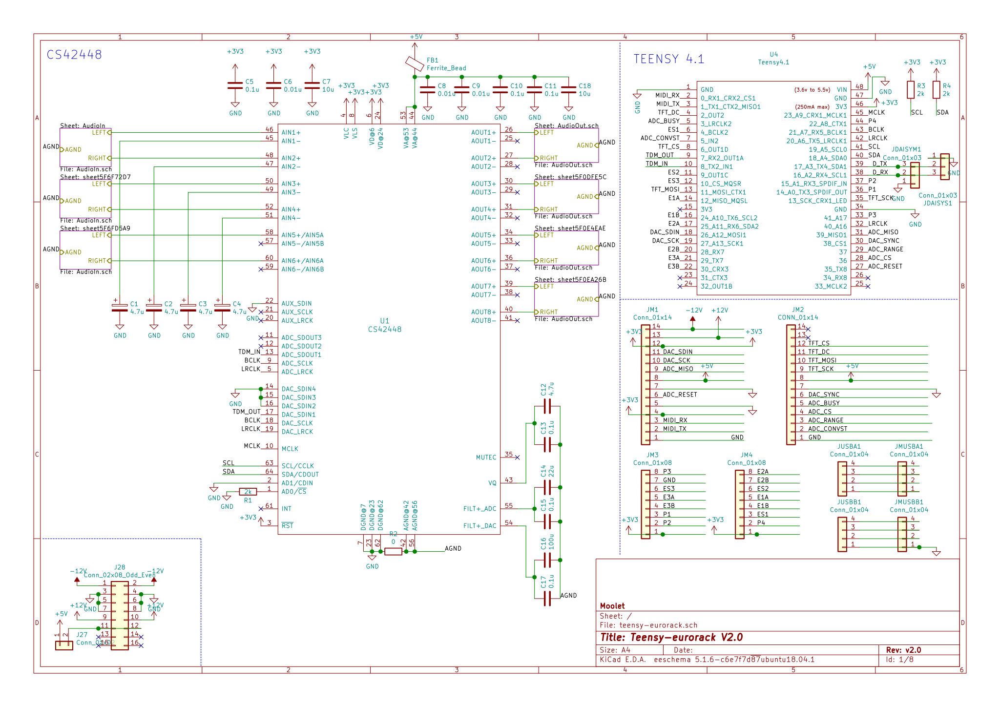

# teensy eurorack audio shield 

-------------------------------

**open source [hardware](hardware) and [software](software) for a 30-channel (14 in / 16 out) 16-bit analog [teensy 4.1](https://www.pjrc.com/store/teensy40.html "teensy 4.1 board") eurorack shield** 

* add peripherals to extend your [teensy 4.1](https://www.pjrc.com/store/teensy40.html "teensy 4.1 board") to interface with 
  * analog line audio (6 in / 8 out)
  * analog control voltages (8 in / 8 out: -10 to +10 volts)
  * midi in/out

* [sponsor](#sponsor)
* [specifications](#specifications)
* [license](#license)
* [open source software-stack](#open-source-software-stack)
* [building / interactive BOM files](#Building)
* [source code](#source-code)
* [improvements](#improvements)
* [printed circuit boards](#printed-circuit-boards)
  * [mainboard](#mainboard)
  * [breakout board](#breakout-board)
* [schematics](#schematics)  
* [panel design](#panel-design)  
* [assembly technical drawings](#assembly-technical-drawings)
* [youtube videos](#youtube-videos)
* [versions](#versions)
* [todo](#todo)
* [continuous-integration](#continuous-integration)
* [credits](#credits)
* [sponsored by](#sponsored-by)

For stable, tested version please see 

# sponsor
* [patreon/teensy_eurorack](https://www.patreon.com/teensy_eurorack)
* BitCoin: bc1qxkm5nhzf5wqhgtxx8fcqw328z2jxhv25qmm2d9
* paypal.me: [paypal.me/nicnewdigate](https://paypal.me/nicnewdigate)

# specifications
* **microcontrollers:** 
  * 600 Mhz ARM cortex m7 ( [teensy 4.1 board](https://www.pjrc.com/store/teensy41.html "teensy 4.1 board") )
* **audio:** multi-channel audio codec ( 6-in / 8-out 24-bit sound card - [CS42448](https://statics.cirrus.com/pubs/proDatasheet/CS42448_F5.pdf) )
  * *the audio codec circuit originally started as a discussion on quad audio channel outputs and a pcb design integrating teensy and cs42448 from Paul Stoffregen on [pjrc forum](https://forum.pjrc.com/threads/41371-Quad-channel-output-on-Teensy-3-6?p=138828&viewfull=1#post138828)*
* **analog control voltage ins/outs:** -10V to 10V 16bit/sample, 8 x inputs and 8 x outputs ( [ad7606](https://www.analog.com/media/en/technical-documentation/data-sheets/ad7606_7606-6_7606-4.pdf), 2x [ad5754](https://www.analog.com/media/en/technical-documentation/data-sheets/AD5724_5734_5754.pdf) )
* **display:** ST7735 128x128 16bit-color tft display
* **breakouts:** 
  * microSD card socket, 
  * USB host/device, 
  * midi in/out, 
  * knobs (4 x pots, 3 x encoders w/switch)
* **panel:** 24HP aluminium panel mounted for eurorack case
* **programability**: 
  * write arduino compatible c/c++ firmware & program using arduino/teensyduino
  * arm gnu toolchain [downloads](https://developer.arm.com/tools-and-software/open-source-software/developer-tools/gnu-toolchain/gnu-rm/downloads)
  * teensy [audio library](https://www.pjrc.com/teensy/gui/)

# license
* All artifacts are MIT license unless otherwise specified on a per file basis.

# open source software stack
* All [schematics](hardware/CIRCUITS.md) and boards are created using [Kicad](http://kicad-pcb.org/) 
* All mechanical designs are created using [FreeCAD](https://github.com/FreeCAD/FreeCAD)
* Some images have been rendered using [Blender 2.81](https://www.blender.org/)

# building
* Parts
  * Parts not on BOM:
    * Teensy 4.1 (with pins)
    * 100m FPC cable same side connectors, 1mm pitch, 8 conductors
    * pin headers and sockets
    * USB-A socket
  * Mouser BOM
    * [mainboard](https://eu.mouser.com/ProjectManager/ProjectDetail.aspx?AccessID=e554cc1725)
    * [breakoutboard](https://www.mouser.com/ProjectManager/ProjectDetail.aspx?AccessID=76e89a9e69)
* Interactive BOM urls:
  * [mainboard](https://newdigate.github.io/teensy-eurorack/teensy-eurorack)
  * [breakoutboard](https://newdigate.github.io/teensy-eurorack/teensy-eurorack-breakout)

# source code
 * Teensy Audio library drivers for ad5754, ad7606 via SPI
   * [teensy-audio-ad5754-ad7606](https://github.com/newdigate/teensy-audio-ad5754-ad7606)
 * simple standard midi file reader 
   * [midi-smf-reader](https://github.com/newdigate/midi-smf-reader)
 * generic sequencer
   * [teensy-quencer](https://github.com/newdigate/teensy-quencer)
 * variable rate playback
   * [teensy-variable-playback](https://github.com/newdigate/teensy-variable-playback)
 * oscilliscope and x/y scope display components
   * [teensy-audio-libtftscope](https://github.com/newdigate/teensy-audio-libtftscope)
 * cmake macros for compiling c++ for arm cortex 
   * [teensy-cmake-macros](https://github.com/newdigate/teensy-cmake-macros)
 * Audio level and CV level meters 
   * [teensy-audio-display-components](https://github.com/newdigate/teensy-audio-display-components)

# improvements
The basic functions of the teensy eurorack shield have been tested and are working at a basic level. Unfortunately version 2 is not entirely ready yet, Im still in the process of varifying it, hopefully shouldnt be too long now... 

At this point Im just focusing on finalising/polishing the current version, but there are some improvements I'd like to make at some point.
* add 4x jack sockets for analog output of knobs on breakout board. 
* use 3.5mm jack sockets (as well as standard midi din connectors) for midi in and out. 
* switch to active audio input and output circuitry, allow switchable 0dB / 12dB gain, for guitar signals.
* let me know if you're think there something else that can be improved, added, removed. 

There is a journal of my progress (its a bit out of date, sorry) - [journal.md](hardware/JOURNAL.md) 

What you can do if you like to see progress with this project?
* [#sponsor](#sponsor)...
* star this repository (means you need a github account - go for it!!)
* subscribe [Nic N on youtube](https://www.youtube.com/channel/UChMicDp8wUXYzBhEN-Wvb5g) 
* download kicad and freecad, clone this repo, make improvements, commit & send pull-requests, and raise issues...

# printed circuit boards
## [mainboard](hardware/boards/mainboard) 
* standard double layer printed circuit board
  * thinkness: 1.6mm  
  * minimum trace: 6 mil
  * minimum clearance: 6 mil
  * dimension: 118mm*102mm
* socket to connect teensy 4.0 board
* cs42448 audio codec 
* 3 x stereo 6.35mm TRS jack inputs
* 4 x stereo 6.35mm TRS jack outputs
* pin sockets to connect breakout board

  

## breakout board
* 2 layer printed circuit board
  * thinkness: 1.6mm  
  * minimum trace: 6 mil
  * minimum clearance: 6 mil
  * dimension: 110mm*111mm
* 8 x 3.5mm jack socket for analog control voltage inputs
* 8 x 3.5mm jack socket for analog control voltage outputs
* midi in/out DIN sockets
* usb device/host
  * USB-B: USB device mode
  * USB-A: USB host mode
* micro-SD card socket
* 4 x linear pots
* 3 x rotary encoders with switches 

  

# schematics

# [panel design](hardware/panel)

# assembly technical drawings 

# youtube videos 
* [Nic N](https://www.youtube.com/channel/UChMicDp8wUXYzBhEN-Wvb5g) 
  * [youtube: Assembling custom eurorack audio shield for teensy 4.1](https://www.youtube.com/watch?v=PzaJ3Wq1Fsc)
  * [youtube: Teensy 4.0 eurorack shield design intro](https://www.youtube.com/watch?v=aNUSEszbnYU)
  * [youtube: 0v to 10v control voltage input, output and display using teensy 4.0](https://www.youtube.com/watch?v=5d5x8F7HRko)
  * [youtube: DIY assembly build - teensy 4.0 eurorack audio module](https://www.youtube.com/watch?v=oZzPgpTrEhc)
  * [youtube: assembly teensy eurorack shield](https://www.youtube.com/watch?v=Jx2KgpoT3WY)
  * [youtube: assembly timelapse](https://www.youtube.com/watch?v=s-514rDjirY)
  * [youtube: Eurorack digital audio modules powered by teensy micro-controller](https://www.youtube.com/watch?v=6zt6OF7UOTc)
  * [youtube: side-channel stereo audio separation with teensy 4.0](https://www.youtube.com/watch?v=N0IBevm4hTQ)

# versions
## v2.1 (Saturday 3 April 2021)
* **Improvement**: Mainboard: Tie LRCLK pin 20 to pin40 to sync DAC/ADC sampling w/ audio sampling
* **FIXED**: breakout: add 1k pull-up resistor to MIDI rx pin
* mainboard: silkscreen: add Kicad OpenSourceHardware logo
* breakout: silkscreen: add Kicad OpenSourceHardware logo

## v2.0.3 (Saturday 13/02/2021)
* breakout: st7735 display changed vcc, reset, backlight from 5v to 3v3.

## v2.0.2 (31/01/2021)
* Mainboard: spaced out traces as there appeared to be some interference under certain circumstances.

## v2.0.1 (27/01/2021) 
* Mainboard: add daisy chain TX/RX connector on back side to communicate between multiple boards
* Breakout board: changed back to double layer board.

## v2.0.0(b)
* Breakout board: Corrected polarity of +-12V pin headers on breakout board (ouch!!!)
* change ADC to use external 2.5v voltage reference, same as DAC voltage reference now 

## v2.0.0
* SPI: separated ADC, DAC from display: 
  * st7735 display has its own dedicated SPI - (SPI0, stays the same)
  * ADC / DAC are now sharing SPI1
* integrated ADC and DAC into teensy audio library.
* added one more ad5754 DAC for total of 8 control voltage analog output channels

## v1.9.1b
* mainboard: correction: reconnected LRCLK to codec.

## v1.9.1
* connected DAC_SCK output (pin 19) to pin 31
  * allow cable select to be asserted on minor spi data cycle after every 24 or 48 spi clock cycles, using interrupt on pin 31.
    * hopefully this will allow DMA spi transfers to AD5754 and which will make integration with teensy audio library much easier

## v1.9 
updated to teesy 4.1 and improvements to make easier to build
* updated from teensy 4.0 to teensy 4.1
* schematic, footprint and pcb clean-up 
  * replaced footprints imported from eagle with native kicad footprints
* removed atmel samd21 and gpio ICs
* replaced gpio with AD5754 (extra 4 DAC channels)
* replaced RGB encoders with regular encoders
* replaced analog-GND-to-digital-GND footprint with a 0805 zero ohm resistor footprint. (DRC checks can pass now...)
* (temporarily) removed serial TX/RX to unused eurorack power pins
  
# todo 
- [ ] finalize design / circuits / boards
- [x] ~~order~~ (v.2.0.3)
- [x] ~~assemble~~
- [ ] testing
  - [x] ~~CS42448 audio codec~~
    - [x] ~~Audio input~~
    - [x] ~~Audio output~~
  - [x] ~~control voltage input~~
  - [x] ~~control voltage output~~
  - [ ] usb host
  - [ ] usb device
  - [ ] midi in/out
  - [x] ~~st7735 display~~
  - [ ] sd card extension & adapter
- [ ] Document 
  - [ ] order & build process
  - [ ] software process
- [ ] Firmware

# continuous-integration 
* testing automated build and packaging 
* [github.com/pwuertz/kicad_picknplace_assistant](https://github.com/pwuertz/kicad_picknplace_assistant)
* [github.com/productize/kicad-automation-scripts](https://github.com/productize/kicad-automation-scripts)
* [InteractiveHtmlBom](https://github.com/openscopeproject/InteractiveHtmlBom) by [openscopeproject](https://github.com/openscopeproject)

# credits 
* https://github.com/dgouramanis/usdextendercable

# sponsored by
Massive thanks to these generous people who have provided support!
* Hannes Schnaitter
* Daniel Hengeveld [thedaniel on github](https://github.com/thedaniel)
* Derek Brost
