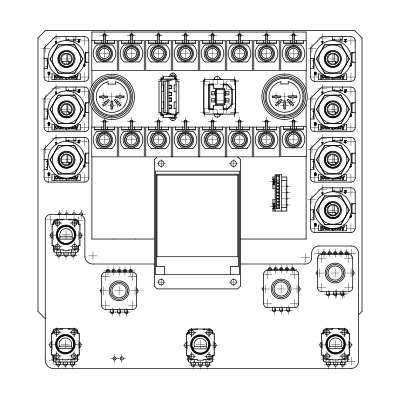

# schematics and printed circuit boards
* schematics and pcb-layouts for each board [here](boards)
  * autodesk eagle cad .sch and .brd files 
  * [printed circuit boards design files](boards) 
* some circuit [images](CIRCUITS.md)
* & some more images [here](IMAGES.md)

