# schematics, printed circuit boards, and panels
* schematic and circuit board files for each board [here](boards)
* panel designs [here](panel)
* schematic [images](#circuits-images)
  * [main-board](#mainboard)
  * [breakout board](#breakout-board)

### credits
* parts of this board are based on [Arduino MKR Zero](https://store.arduino.cc/arduino-mkr-zero-i2s-bus-sd-for-sound-music-digital-audio-data) design by Arturo Guadalupi (v5.0)

# circuits images
## mainboard
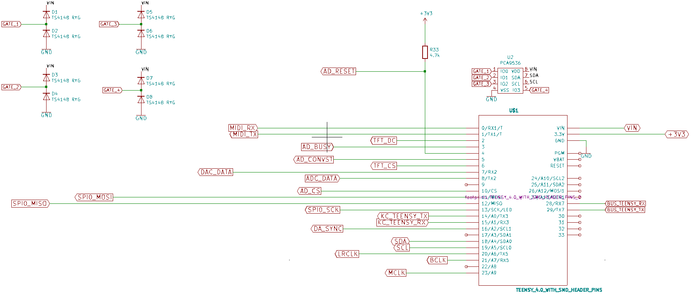
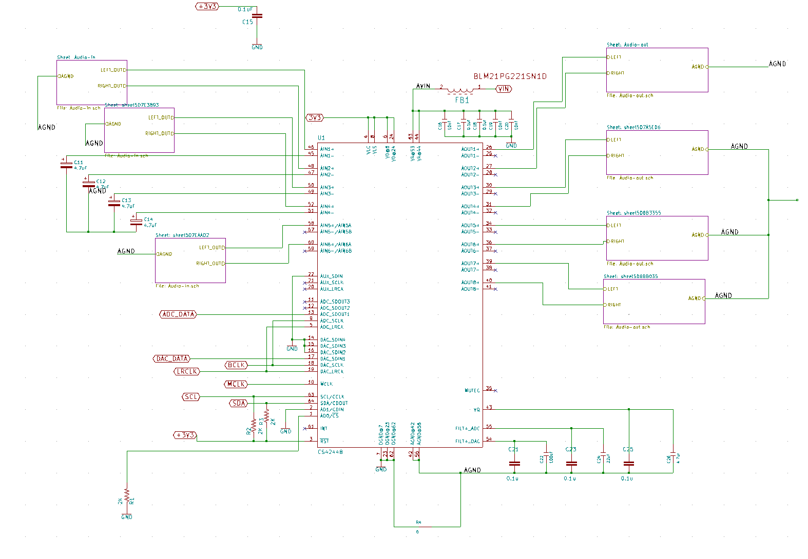
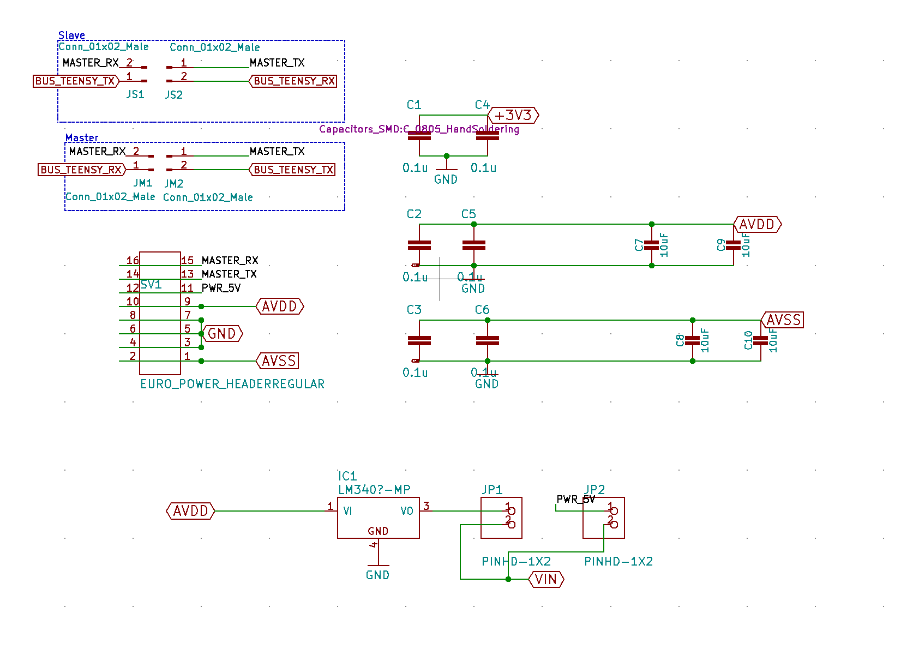
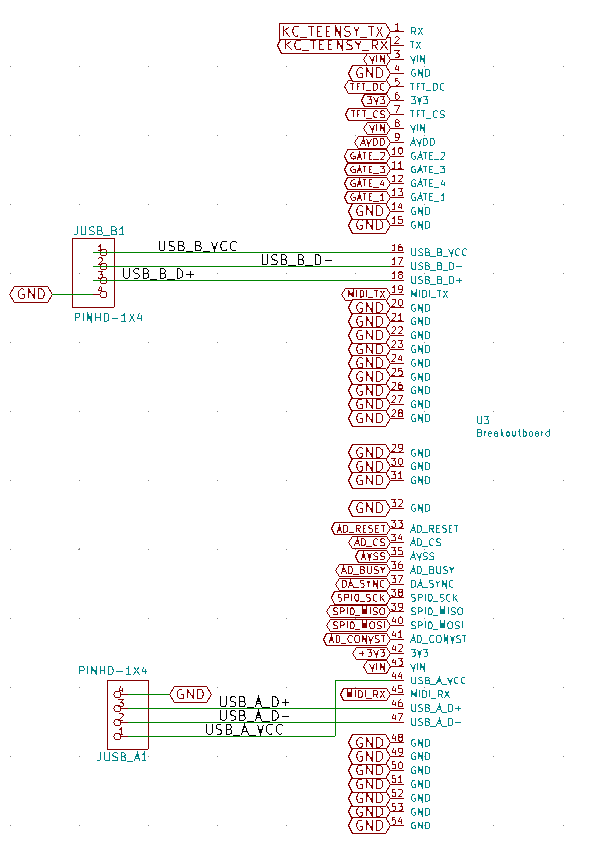
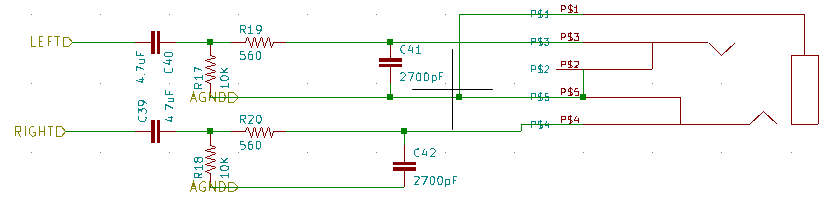
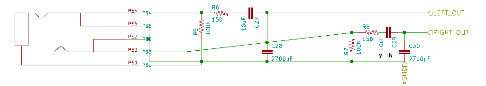

## breakout board
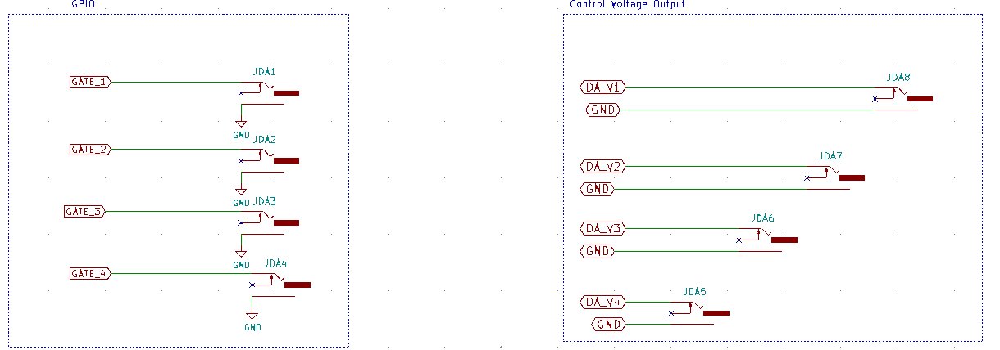
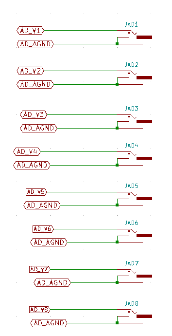
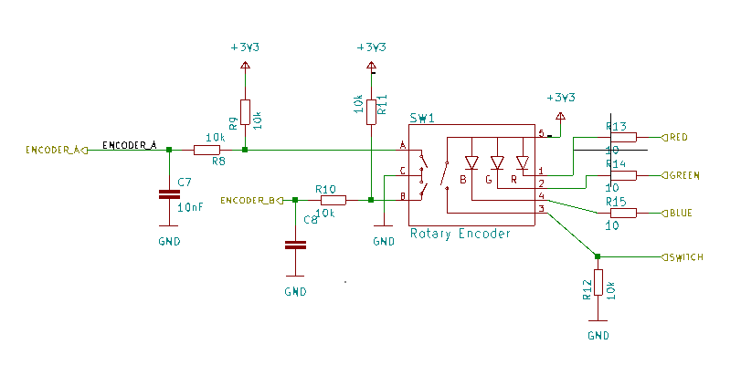
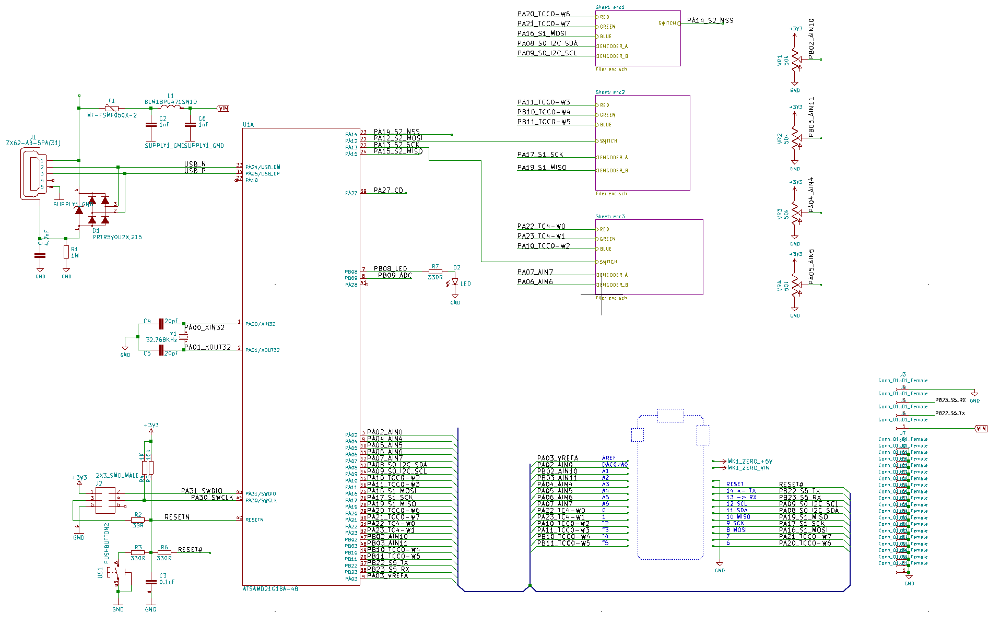

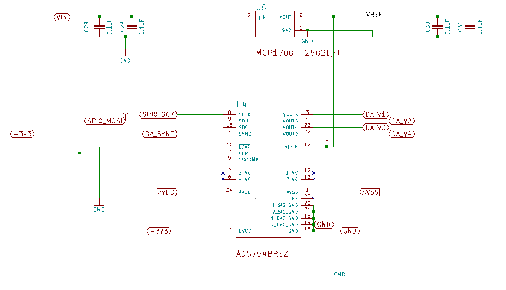
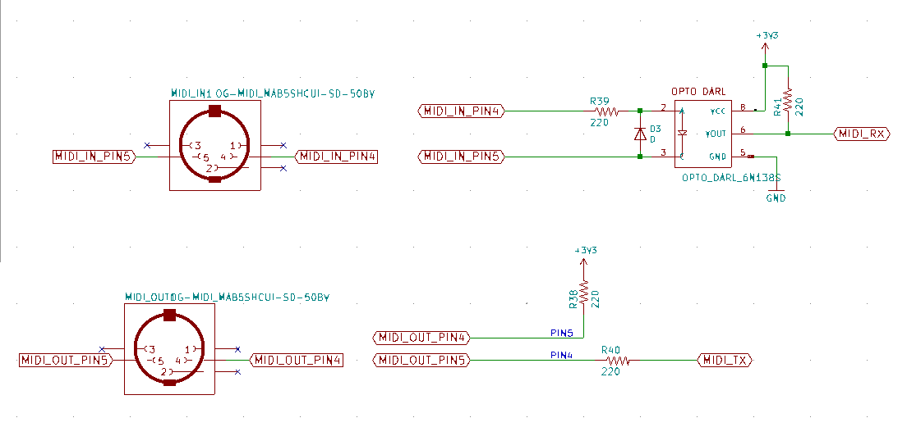
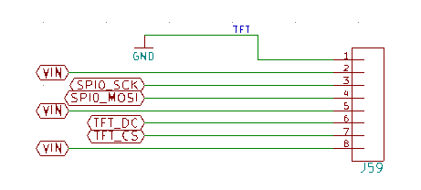
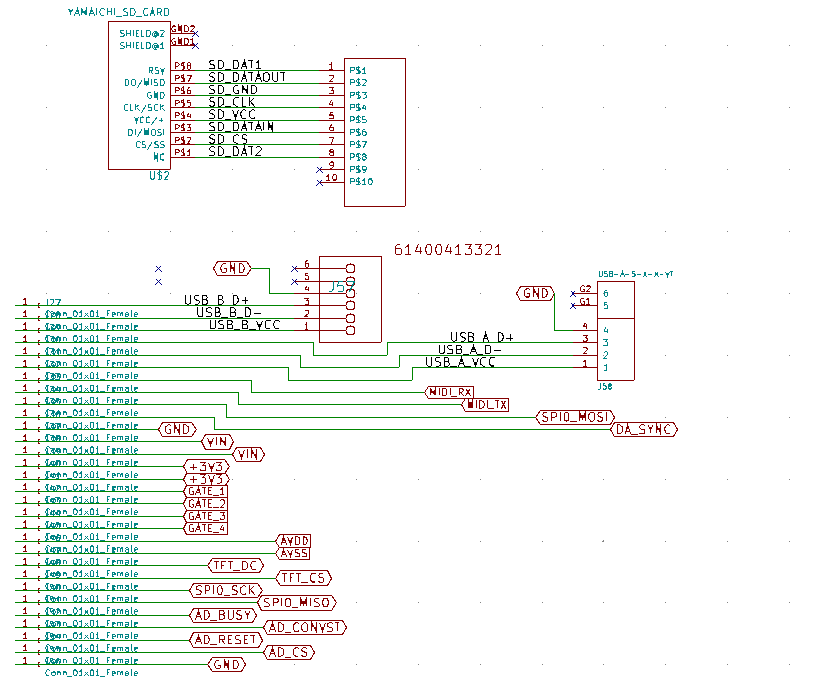

