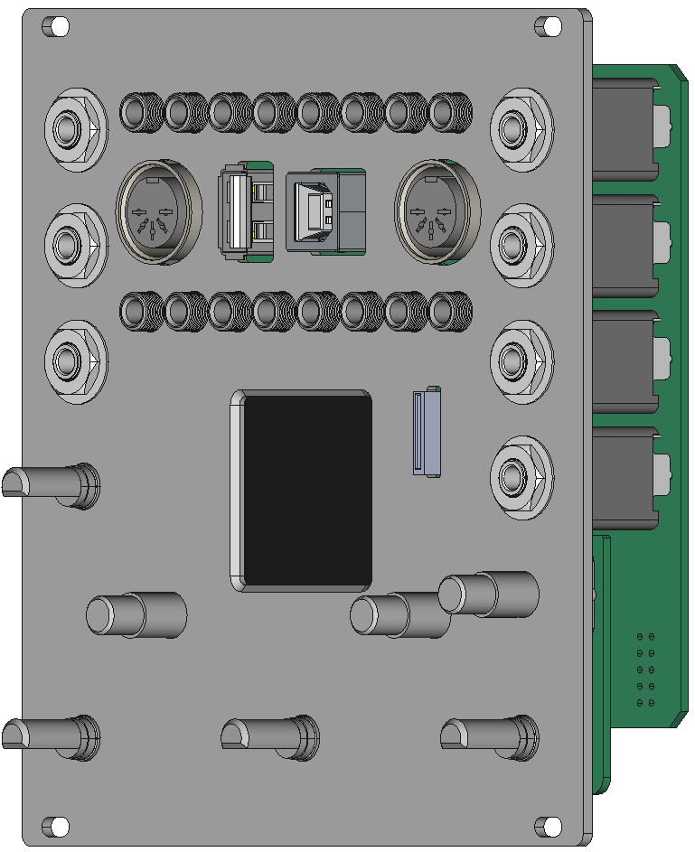
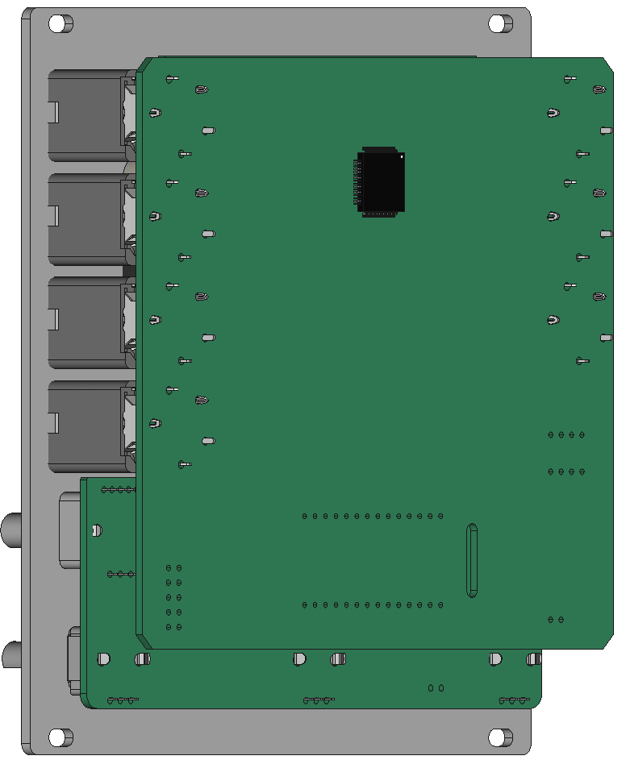
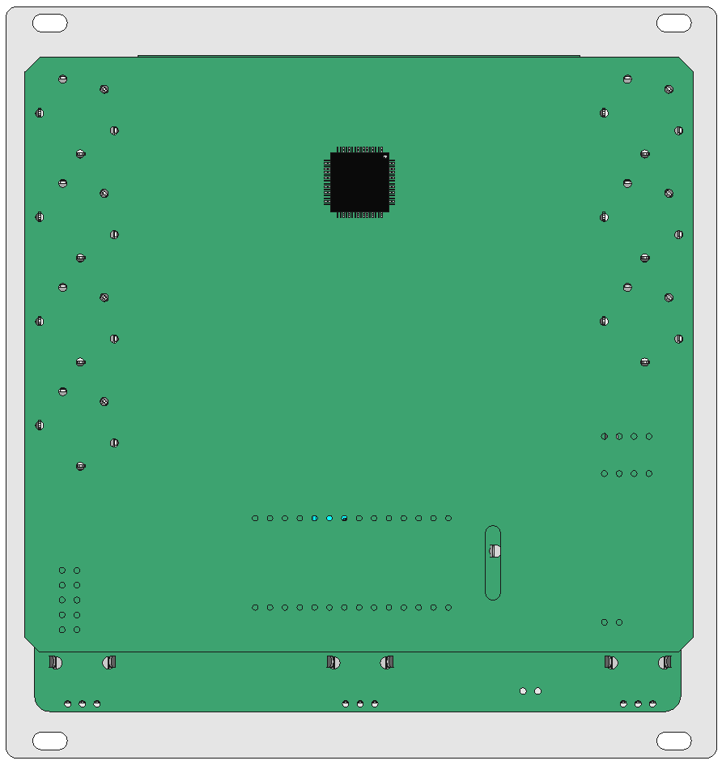
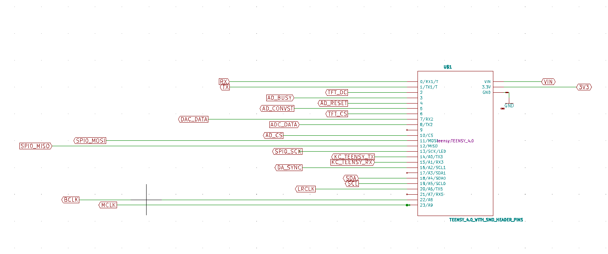
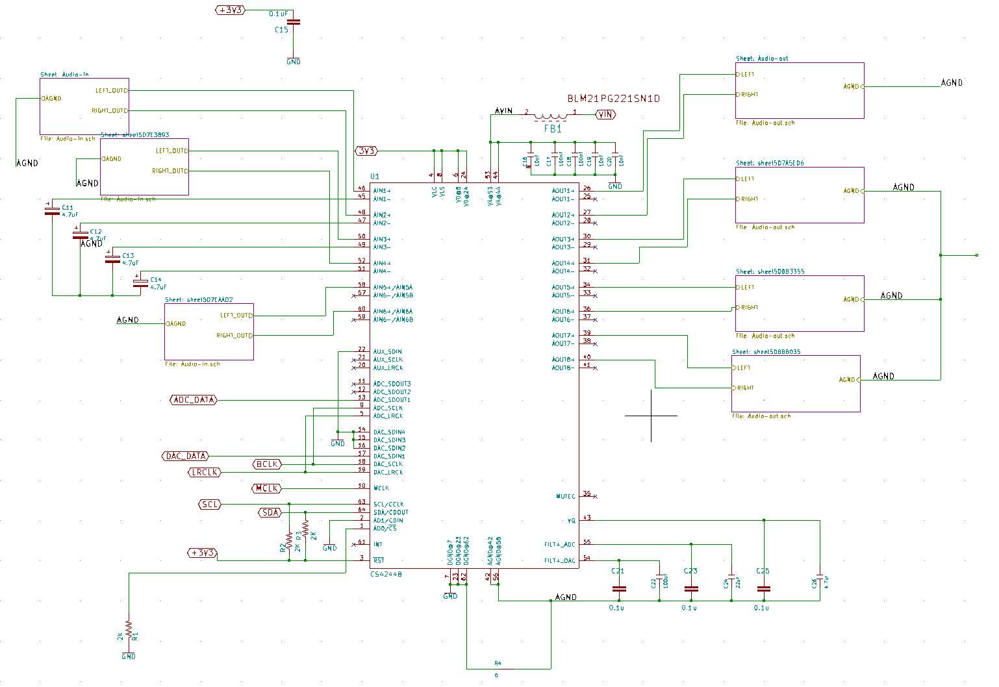
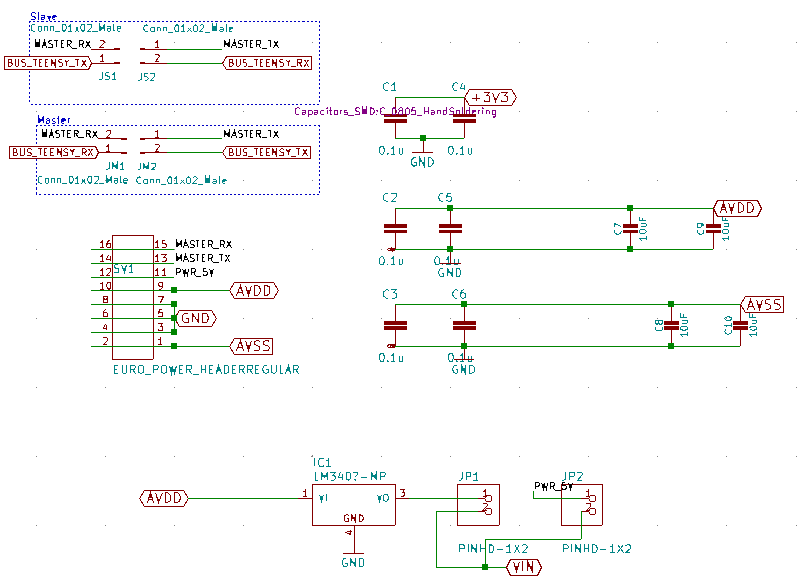
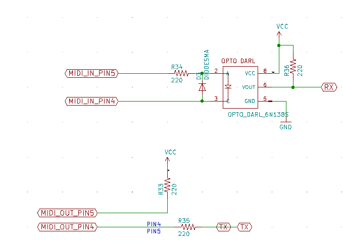
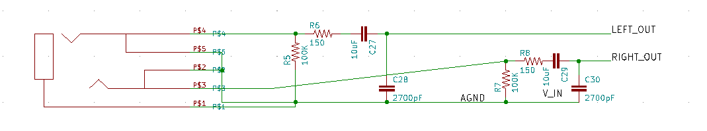
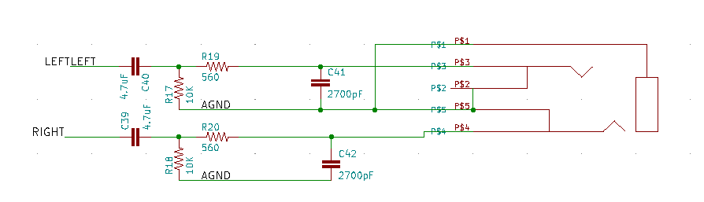

# schematics, printed circuit boards, and panels
* schematic and circuit board files for each board [here](boards)
* panel designs [here](panel)
* schematic [circuit images](#circuits-images)
  * [main-board](#mainboard)
  * [top-breakout board](#top-breakout-board)
  * [knobs-controller board](#knobs-controller-board)

       

# circuits images
## mainboard
### Teensy micro-controller connections

### cs42448 audio codec

### power

### midi

### audio in

### audio out

## Top-breakout board
[todo]

## Knobs-controller board
[todo]
