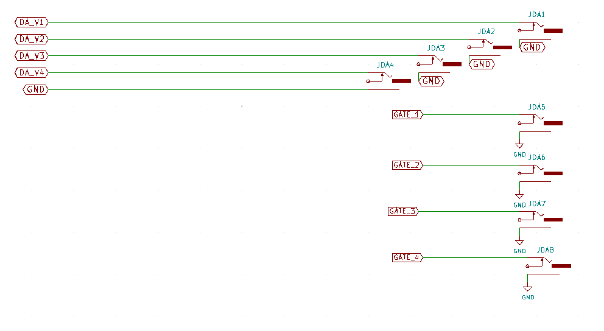
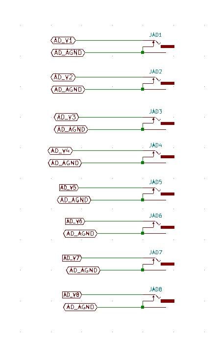
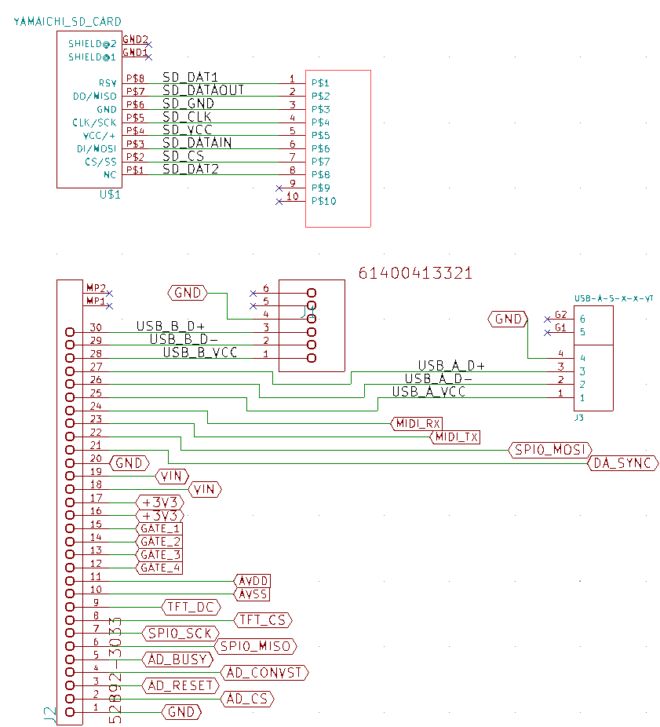
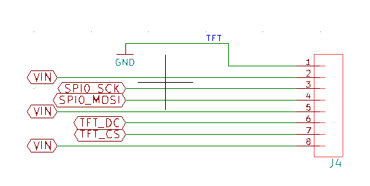
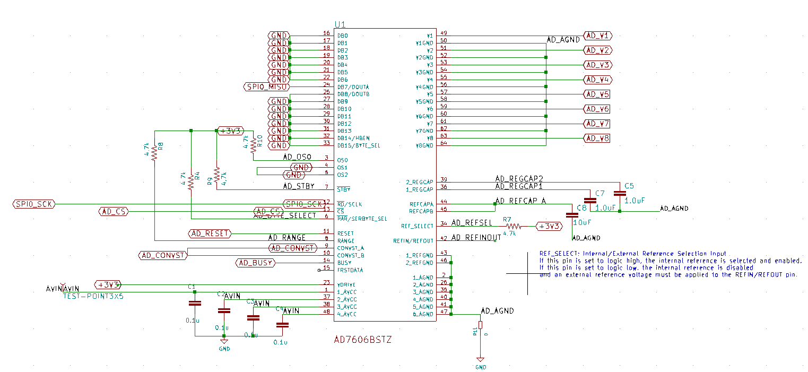
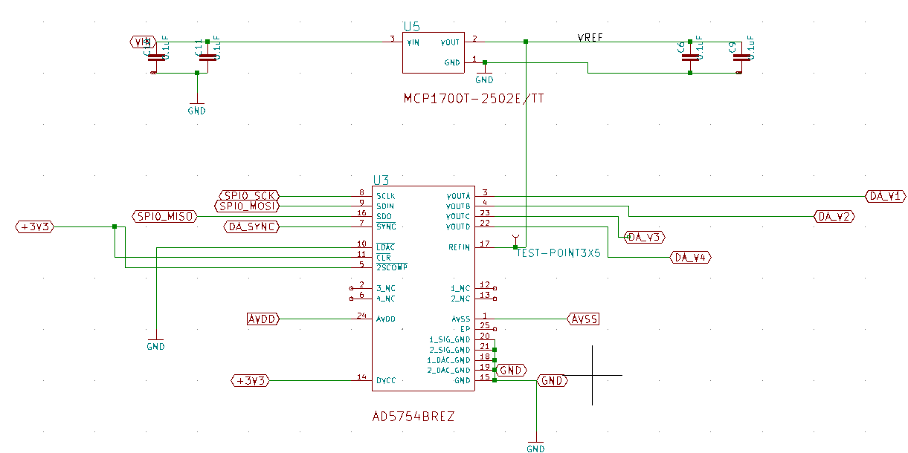
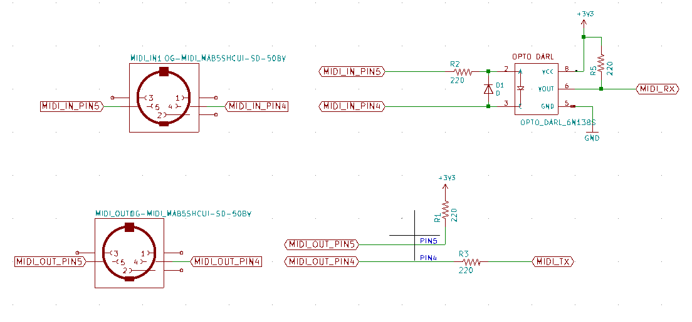
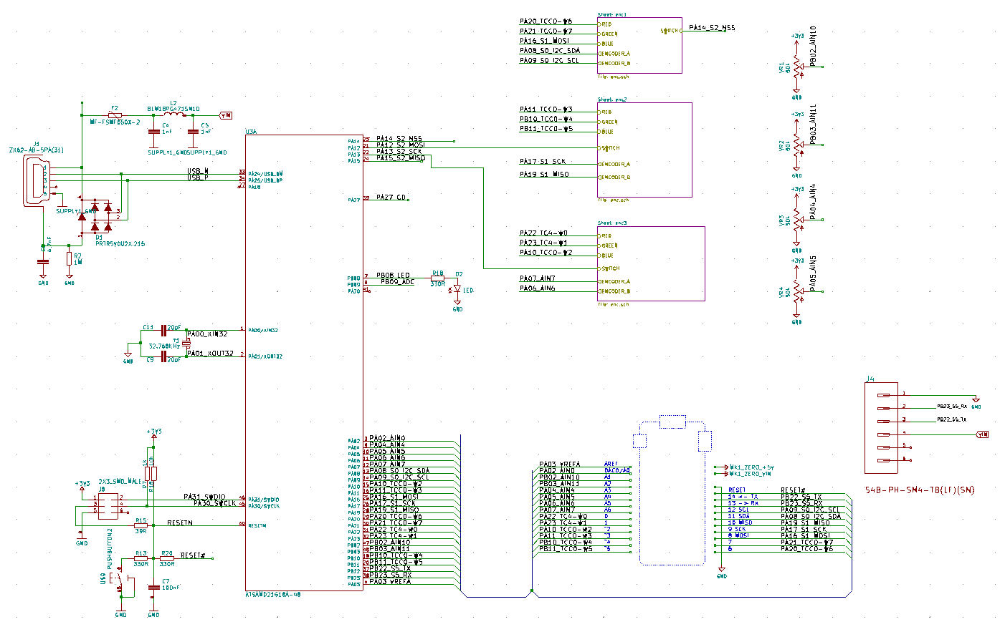
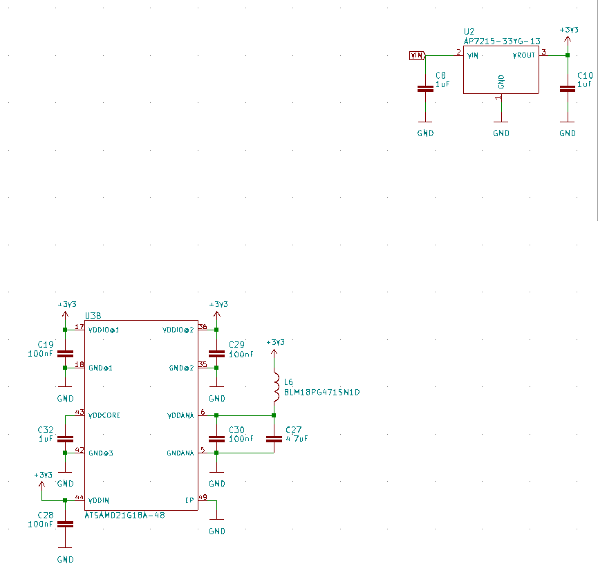
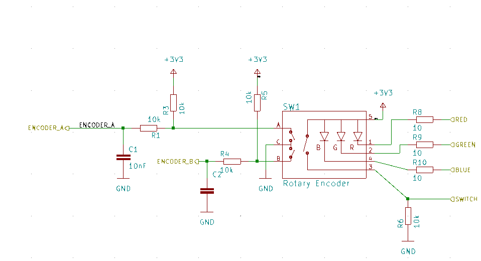

# schematics, printed circuit boards, and panels
* schematic and circuit board files for each board [here](boards)
* panel designs [here](panel)
* schematic [circuit images](#circuits-images)
  * [main-board](#mainboard)
  * [top-breakout board](#top-breakout-board)
  * [knobs-controller board](#knobs-controller-board)

       

# circuits images
## mainboard
### Teensy micro-controller connections

### cs42448 audio codec

### power

### midi

### audio in

### audio out

## Top-breakout board
### dac

### adc

### fpc

### tft

### ad7606

### ad5754 

### midi

## Knobs-controller board
### credits
* this board is based on [Arduino MKR Zero](https://store.arduino.cc/arduino-mkr-zero-i2s-bus-sd-for-sound-music-digital-audio-data) design by Arturo Guadalupi (v5.0)
### knobs microcontroller

### power

### encoder

