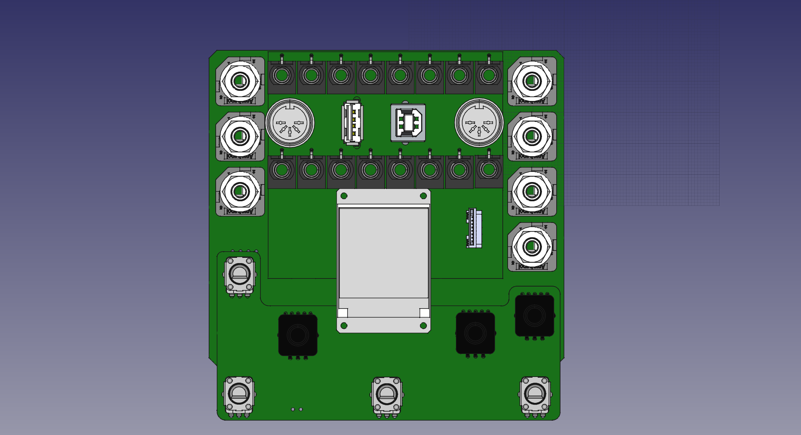
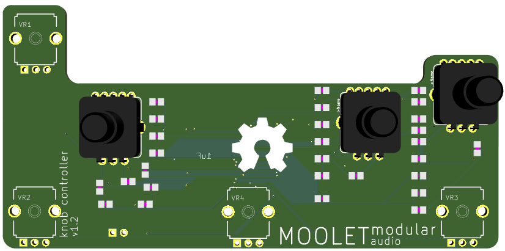

| | **board** | **description** |
|---|-------|---------|
|    | [main](mainboard) | **2-layer:** mainboard - contains a teensy4, a cs42448 audio codec and connectors for top and bottom breakout boards |
|    | [top breakout](topbreakout)  | **2-layer:** 3.5mm jack analog inputs/outputs, midi in/out, usb device/host, uSD extension breakout |
|  | [knobs-controller](knobs-controller)  | **2-layer:** 4 x pots, 3 x RGB rotary encoders with switches |
|   | [uSD extension breakout](teensy-uSD-adapter) | **2-layer**: uSD extension adapter board |
  
